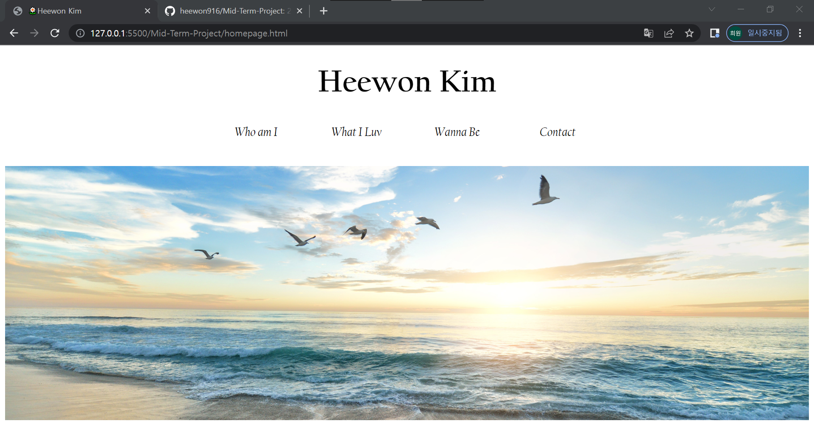
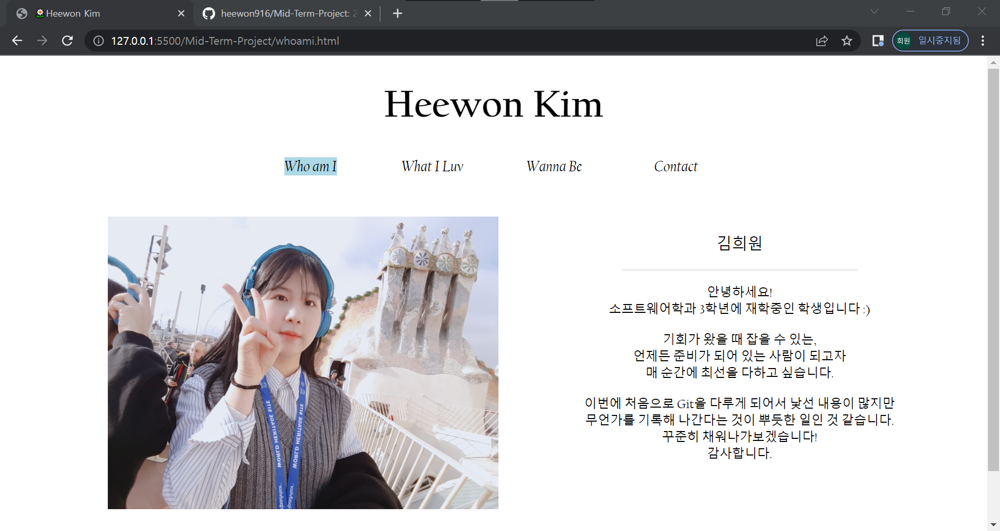
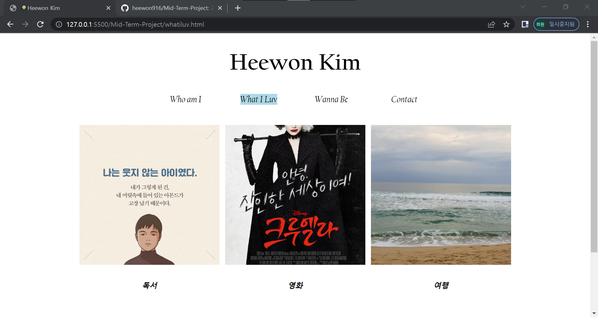
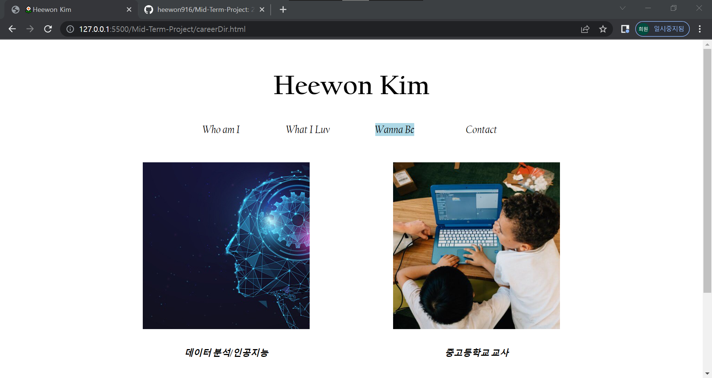
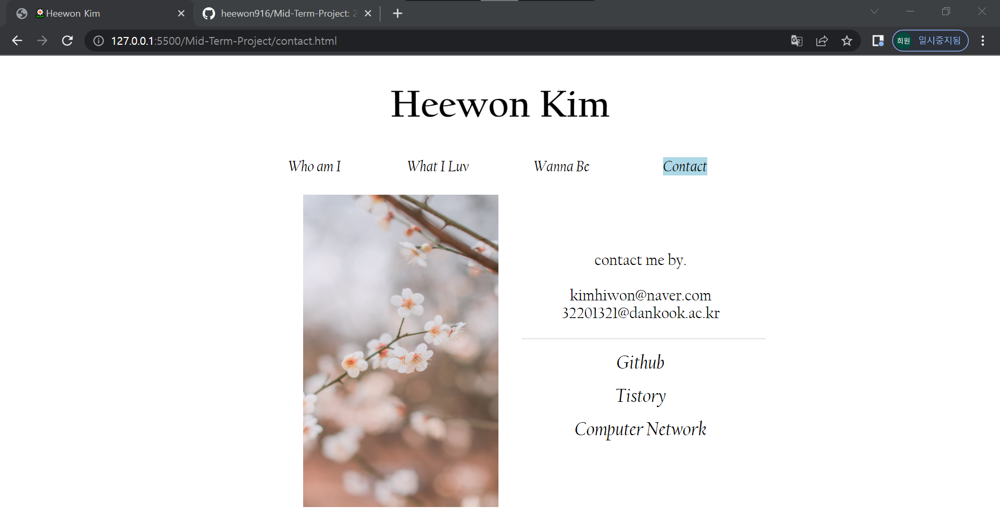

# 2022 오픈소스 SW활용 2분반 

- 이름: 김희원
- 학과: 소프트웨어학과
- 학번: 32201321

## /* 기본 파일 */ 
- Homepage ==> homepage.html :: 기본 홈페이지 
- whoami.html ==> 자기소개 페이지
- whatiluv.html ==> 좋아하는 것에 대한 내용
- careerDir.html ==> 진로분야에 대한 내용
- contact.html ==> 연락 수단에 대한 내용

## /* 각 html 파일에 대한 css 파일 */
- whoami.css
- whatiluv.css
- careerDir.css
- contact.css

## /* 사진 자동 슬라이드에 대한 js 파일 */
- show_flower.js
- show_img_slide.js
- show_img_careerDir.js

## 결과물 

